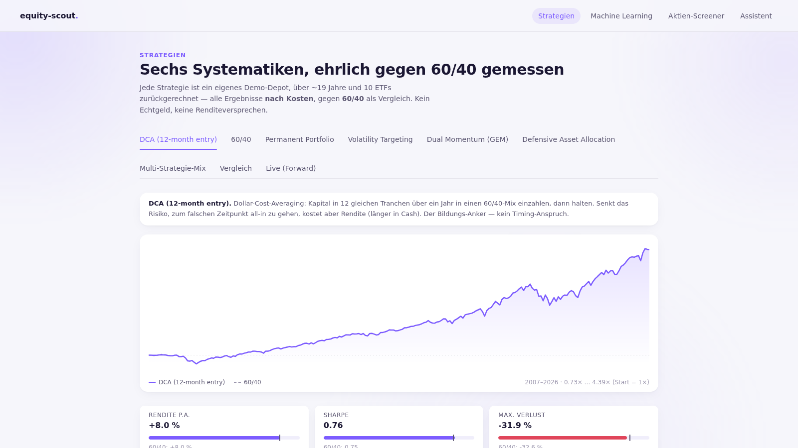
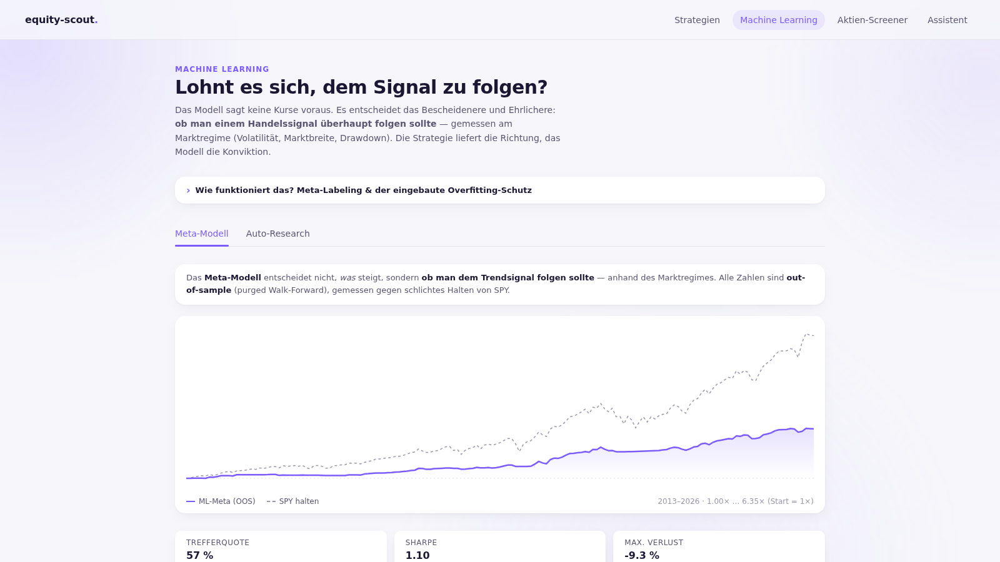
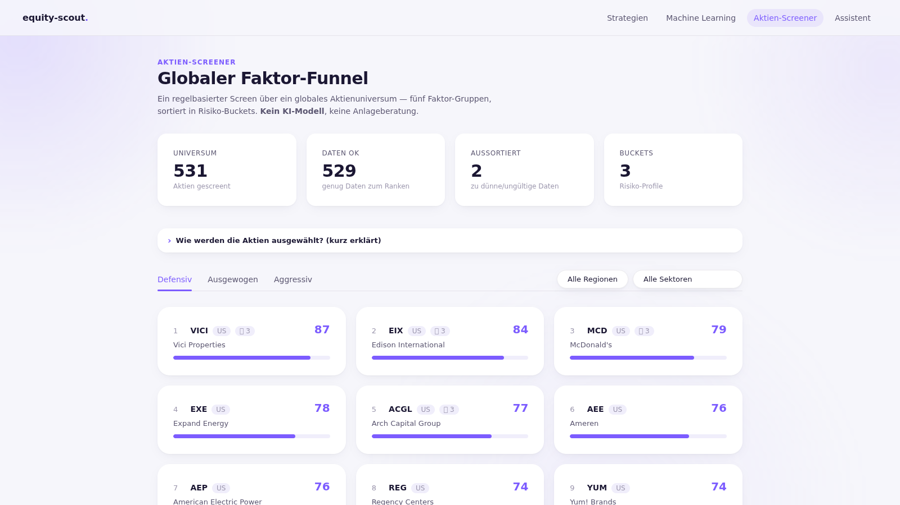

# equity-scout

Local, free research harness with two parts, switchable from the dashboard top nav:

1. **Strategien** — N systematic strategies as own paper accounts over a 21-ETF basket (DCA, 60/40,
   Permanent Portfolio, Vol-Targeting, Dual-Momentum/GEM, Defensive Asset Allocation, SPDR sector
   momentum rotation), each backtested
   over ~19 years **after costs** vs 60/40, plus an **ML meta-model** (triple-barrier meta-labeling,
   purged walk-forward) that learns *whether to follow* the trend signal from the market regime,
   plus a **continuous research loop** that searches model configurations in the background and gets
   better by widening the search — with a Deflated-Sharpe hurdle that rises with every trial to block
   overfitting (it cannot improve by re-fitting the same data; only by honest, OOS-validated search).
2. **Aktien-Screener** — the original quant factor screen over a global stock universe → risk buckets
   → LLM thesis → drilldown.

The strategies also run **forward** as live paper accounts (Live tab — a true out-of-sample track that
builds over real time), the ML tab carries **per-bet self-analysis** (where the model was wrong, in
which regime) and a second overfitting check (**CSCV-PBO**), and an **Assistent** tab answers questions
about any screened stock via a local **Ollama** model (no data leaves the machine): key figures
(P/E, price/book, ROE, margins, growth, momentum, F-Score), who has been buying (congress filings
with their reporting lag, 13F funds, quoted voices), entry score and zone, pitches, both depots,
market regime and measured results. Facts are retrieved deterministically BEFORE the model sees the
question — the LLM only phrases what local code selected — and buy/sell questions are refused by a
fixed sentence that never reaches the model.

**Research assistant — not investment advice, no edge promise.** Every result is after-cost and
out-of-sample; the honest takeaway is process/risk, not alpha (see `docs/research/`). Two known
methodology caveats — the backtest rebalances monthly while the forward/live path runs daily, and
the ML training universe is survivorship-biased (today's watchlist backfilled from 2007) — are
surfaced live in the dashboard's model report (`/api/model` → `caveats`).







The dashboard needs a locally running backend (FastAPI + SQLite + yfinance) — there is no hosted
demo. Start it with the quickstart below.

Docs: strategy/ML plan `docs/superpowers/plans/2026-06-24-multi-strategy-v2.md`,
research `docs/research/2026-06-24-strategy-ml-data-research.md`,
funnel design `docs/superpowers/specs/2026-06-24-equity-scout-design.md`.

## Quickstart (after `uv sync`)

```bash
# Strategies: backtest all 6 over the ETF basket (first run fetches the price panel; --refresh re-fetches)
uv run python scripts/run_backtest.py --refresh   # prints metrics + cost sweep {0,5,10,20} bps

# Continuous ML research loop in the background (resumable; the Auto-Research dashboard tab is live)
nohup uv run python scripts/run_research.py > research.log 2>&1 &

# Strategy-parameter search (v14): finite grid over the rule strategies' knobs, whole-history
# after-cost backtests, OWN trial ledger + OWN DSR hurdle (never mixed with the ML pool above).
# In-sample evidence only — champions are never auto-promoted into the live sleeves, because
# changed parameters are a new strategy identity with a fresh forward track record.
uv run python scripts/run_strategy_research.py --trials 43   # nightly chain runs 25/night

# Offline deterministic run (fake provider)
uv run python scripts/run_scout.py --provider fake --db equity_scout.db

# Refresh the combined universe snapshot (~7.5k tickers: every US-listed common stock incl.
# ADRs, plus STOXX 600, Nikkei 225, Hang Seng, CSI 300, KOSPI 200, NIFTY 100, TSX Composite,
# ASX 200, B3 and the curated CSV — see data/universe_combined.PROVENANCE.md)
uv run python scripts/refresh_universe.py

# Live run over the combined universe (yfinance, free; cached)
uv run python scripts/run_scout.py --provider yfinance --universe data/universe_combined.csv --db equity_scout.db

# Advance the paper portfolio against the latest picks (demo money, buy-and-hold; PAPER ONLY)
uv run python scripts/run_paper.py --db equity_scout.db --bucket balanced --threshold 0.70

# Advance the forward paper accounts one step (daily/cron; idempotent) → "Live (Forward)" tab
uv run python scripts/run_forward_paper.py --refresh

# Advance the Auto-Depot (meta-allocated, risk-managed paper book; idempotent) → "Auto-Depot" tab
uv run python scripts/run_autotrader.py

# Probability of Backtest Overfitting over the top configs (slow, occasional) → Auto-Research tab
uv run python scripts/run_pbo.py

# Local assistant ("Assistent" tab): run Ollama + pull the model (configurable via OLLAMA_MODEL)
ollama serve & ollama pull qwen2.5:7b   # measured better and 7x faster than llama3.1:8b
# Repeatable quality check for the assistant (needs the dash service + Ollama running):
uv run python scripts/eval_chat.py

# Build the React dashboard once, then serve it
cd frontend && npm install && npm run build && cd ..
uv run python scripts/run_api.py --db equity_scout.db   # http://127.0.0.1:8000
```

The dashboard shows the risk buckets with a per-pick score-transparency drilldown
(percentile x weight = contribution) and the paper portfolio's value vs. a benchmark.
Scheduling a recurring run: see `docs/scheduling.md`. Factor definitions: `docs/factors.md`.

## Trading copilot (radar → pitch → one-tap decision)

On top of the screener, the copilot watches funnel finalists for genuinely attractive entry
prices and turns them into decision pitches (spec:
`docs/superpowers/specs/2026-07-04-trading-copilot-design.md`):

```bash
# 1. Radar: entry sub-signals + watchlist with entry zones (needs a prior run_scout run)
uv run python scripts/run_radar.py --db equity_scout.db --json-out watchlist.json

# 2. Notify: watchlist → inbox pitches (+ Telegram send if configured; --dry-run = inbox only)
uv run python scripts/run_notify.py --db equity_scout.db --dry-run

# 3. Receiver: long-polls Telegram for [Kaufen]/[Ablehnen]/[Später] button decisions
uv run python scripts/run_receiver.py --db equity_scout.db

# 4. Daily digest (prints to stdout when SMTP is not configured)
uv run python scripts/run_digest.py --db equity_scout.db

# 5. Arena: advance both paper lanes one step (nico = approved pitches, autopilot = score-autonomous)
uv run python scripts/run_lanes.py --db equity_scout.db   # daily/cron; idempotent per UTC day

# 6. Train: price-derived backfill → purged walk-forward → register/promote the champion model
uv run python scripts/run_train_entry.py --db equity_scout.db --tickers EXE,EQT,VICI,CF,WDC
#    (no --tickers → latest watchlist tickers, else a small fallback universe; --model, --start)

# 7. Score: the champion scores the current watchlist and LOGS each live prediction to the ledger
uv run python scripts/run_score_watchlist.py --db equity_scout.db   # the 'predict' half of the loop

# 8. Resolve: fill the realized outcome of every logged prediction whose 20-day horizon has elapsed
uv run python scripts/run_resolve_predictions.py --db equity_scout.db
```

Two paper lanes trade the same signals side by side with identical sizing, fills and exit
rules (profit target / stop loss / max holding period), each tracked against buy-and-hold SPY —
"Du vs. Autopilot vs. Markt". Lane "nico" only buys pitches you approved; lane "autopilot"
buys autonomously above the score threshold. PAPER ONLY — no real orders.

The entry-quality model scores each watchlist entry 0–100 = P(it beats SPY over ~20 trading days),
across three separate stages so the "the model improves" claim stays a queryable fact, not a
promise:

- **train** (`run_train_entry.py`) builds a strictly price-derived historical backfill (no
  fundamentals — yfinance has no history, so a fundamentals backfill would be look-ahead), scores
  it out-of-sample with a purged, date-grouped walk-forward, and promotes a challenger only on a
  strictly better OOS AUC;
- **score** (`run_score_watchlist.py`) has the current champion score today's watchlist and appends
  every live score to an immutable prediction ledger *before* the outcome is known;
- **resolve** (`run_resolve_predictions.py`) fills each prediction's realized outcome against real
  forward prices once its horizon has elapsed — never a back-filled guess.

The score RANKS entry attractiveness — it is a calibrated probability, not a price forecast and not
advice.

Dashboard endpoints: `GET /api/radar`, `GET /api/inbox`, `POST /api/inbox/{id}/decision`,
`GET /api/arena`, `GET /api/model` (registry, champion metrics, resolved-prediction stats),
`GET /api/evidence` (events, alerts, per-source hit-rates, person scores).

## External evidence + person track records

Five free external sources annotate pitches and can raise separately-labelled alerts —
they NEVER change the entry composite or selection rules:

```bash
# Collect congress trades / 13F fund moves / news themes / Form 4 insider buys / voices → store + ledger
uv run python scripts/run_evidence.py --db equity_scout.db

# Resolve due evidence rows against real forward prices vs SPY (60d horizon)
uv run python scripts/run_resolve_evidence.py --db equity_scout.db

# Measure person track records (weekly; backfills each active filer's full history)
uv run python scripts/run_person_scores.py --db equity_scout.db
```

- **US congress trades** (kadoa-org/congress-trading-monitor mirror, MIT): purchases only.
  Members may file up to **45 days** after trading. §105(c) STOCK Act restricts commercial
  use — fine for this private local tool, re-check before any publication.
- **13F filings** of ~8 tracked famous funds (SEC EDGAR): quarter-over-quarter new/increased
  positions, up to **135 days** stale. Needs `EDGAR_USER_AGENT` (SEC requires a contact);
  stays politely `unconfigured` without it.
- **News themes** (Google News RSS + MarketWatch + Fed press): deterministic cross-source
  bigram clusters; themes alone never alert (weakest, most-priced-in source).
- **Form 4 corporate-insider purchases** (SEC EDGAR, scoped to the current watchlist tickers):
  open-market buys only (transaction code P + acquired) by directors/officers/10%-owners of
  the companies you are actually watching — the fastest source, but insiders may still file up
  to **2 business days** after trading, so it is still a lag, never an early signal. Needs
  `EDGAR_USER_AGENT`; stays politely `unconfigured` without it. A single insider buying is
  routine noise; **3 or more distinct insiders** buying independently inside the alert window is
  the robust cluster signal (Cohen/Malloy/Pomorski) and raises an alert.
- **Voices** (Google News RSS + Bing News RSS person queries, free, undocumented feeds): what
  the tracked famous investors (the managers behind the 13F funds — Buffett, Burry, Ackman, …)
  **say in public**. These are mentions feeds, so the honest boundary is deterministic: a
  headline only becomes a **measurable call** when the speaker's name precedes a direction
  phrase from a closed list AND exactly one universe company resolves from the title — bullish
  calls enter ledger + person track record, bearish calls are shown and alerted but stay out of
  the statistics until signed resolution exists, everything else is context display only.
  A measurable call by a tracked person alerts alone (press headline, no filing).

Every collected event is logged to an append-only ledger BEFORE its outcome is knowable and
resolved later against real forward returns vs SPY — "does congress-following actually
work?" is a query (`/api/evidence`, digest section), not an opinion.

**Person track records:** every disclosed buyer (politician; funds and insiders as their
filings accumulate) is measured with our own methodology — T0 = filing date (the day a reader
could know), abnormal return vs SPY over 1M/3M horizons, **no score below 5 resolvable calls**,
recency-weighted (540d half-life). Measured records annotate pitches/alerts, and a single
buyer with a strong record (≥ +2 % weighted @3M) may alert alone — always labelled
"Historie, keine Prognose". A disclosed trade is a trade, not a recommendation (tax,
liquidity and diversification confound it) — the caveat rides on every surface.

**Alert escalation:** a ticker's alerts share a 14-day cooldown, but a cluster whose distinct
buyer count (across all four sources) grows past the last SENT alert breaks through the
cooldown — a 2-buyer alert must never silence the 4-buyer cluster that follows a week later.
The alert text marks the escalation.

### Insider-Cluster-Schattenlane (v15 P2)

Die historische Studie (P2a, `docs/research/history-study-report.json`, Stand 2026-08-07)
hat 50.955 punktgenaue Ereignisse 2006→2026 aufgelöst. Ergebnis in einem Satz: **Kongress-
und Executive-Käufe zeigen auf 16–21k Messungen pro Horizont keinen wirtschaftlich
relevanten Vorsprung** (r_1w +0,15 % ± 0,03pp bis r_12m −0,39 % ± 0,33pp, Richtungen an
beiden Enden uneins) — deshalb gibt es **keine Kongress-Lane**, die Quelle bleibt reine
Annotation. Übrig bleiben **Insider-Cluster**: r_3m +2,55 % ± 0,67pp auf 13.694 Messungen —
out of sample aber nur noch +0,77 % ± 0,79pp bei 42,9 % Trefferquote, also von Ausreißern
getragen und unter einer Standardabweichung.

Genau dafür gibt es diese Lane — und sie handelt **nichts**:

```bash
# Frische >=3-Insider-Cluster erkennen und je EINE Vorhersage vorab registrieren
uv run python scripts/run_insider_shadow.py --db equity_scout.db          # schreibt
uv run python scripts/run_insider_shadow.py --dry-run                      # nur zeigen
```

- **Kein Kapital, keine Orders, keine Position, keine automatische Beförderung.** Die Lane
  registriert pro Cluster eine Vorhersage im bestehenden Evidenz-Ledger (Quelle
  `insider_shadow`, Horizont **63 Handelstage**, vorab festgelegt) und lässt sie vom
  ohnehin täglich laufenden `run_resolve_evidence.py` gegen echte Kurse vs SPY auflösen.
- **Eine offene Vorhersage pro Ticker**: dasselbe Cluster morgen erneut zu registrieren
  würde n mit fast identischen Ergebnissen aufblähen.
- **Ein Horizont, eine Hypothese.** r_1w bleibt ungetestet, damit ein Treffer etwas heißt.
- Status nach jedem Lauf: `.state/insider_shadow_status.json` (Prior, Lauf-Zähler, Track
  mit Mittelwert + Stderr + Trefferquote, Review-Vorbedingungen, Disclaimer).
- Ob daraus je Kapital wird, entscheidet **Nico** nach ≥60 Tagen Schattenspur und ≥30
  aufgelösten Vorhersagen. Es gibt keinen Codepfad, der das automatisch tut.

## Auto-Depot (vision v10)

ONE automatically traded **paper** depot that combines every strategy lane: the rule-based
sleeves (DCA, 60/40, Permanent, Vol-Target, GEM, DAA, Sector-Rotation) plus each ML bot with a
promoted champion. Sleeve weights come from each sleeve's own forward track record — a 50 %
equal-weight anchor blended with a Sharpe-softmax tilt over a 63-day walk-forward window
(floor 5 % / cap 40 %, monthly recompute; the shrinkage lesson of the 1/N literature). The
aggregated per-ticker book then passes a composable risk layer, in order: single-name cap 10 %,
regime gate (red light → half exposure), a 12 % vol target (never levers up) whose estimator is
the depot's own trailing vol scaled by a VIX-forecast multiplier (study 2026-08-12: implied vol
predicts the next 20 days better than the trailing window; divisor 1.341 for the variance risk
premium, clamp 0.5–3.0, trailing-only fallback whenever the VIX leg is missing), and a tiered
drawdown breaker (≥ 10 % → half, ≥ 20 % → cash, staged recovery after a cooldown). It advances
nightly in `nightly_train.sh` right after the sleeves. Every trade, weight, and risk
intervention is persisted (`autotrader.db`) and surfaced: digest block, `/api/autodepot`,
dashboard tab.

Fill & cost convention (since v13, 2026-07-24): a rebalance decided on one advance fills at
the NEXT advance's open (from a dedicated OHLC panel; honest labelled close fallback when no
open exists — lane fund-share tickers never have one), which closes the old caveat of signal
and fill sharing the same close. Each fill is charged `max(10 bps, half the Corwin-Schultz
high-low spread estimate)` on its notional — a liquidity-aware **lower bound** (the estimator
understates thin names and says nothing about market impact). The forward-paper sleeves
deliberately stay on same-close fills and the flat 10 bps: they are the signal layer,
execution realism lives in the depot.

Labelled caveats: borrow proxy on net shorts, EUR value is a daily-spot
translation (display only, never mixed into strategy return), no Kelly sizing until the depot
has 50+ realised trades, and while the sleeves share < ~3 months of overlapping forward
history the allocation stays pure equal weight ("Anker-Phase") and says so.

**Broker seam (facts only, nothing integrated):** the depot's trade rows are exactly what a
broker adapter would consume. Candidates as of 2026: Alpaca paper API (free, globally
available, 200 req/min), Trading 212 public API beta (`demo.trading212.com` practice
endpoints, Invest/ISA), IBKR paper account (same API as live, needs a TWS/Gateway process).
Wiring ANY of them up is a deliberate human decision. Nico took it on 2026-08-04 for the
**session lane only** (Alpaca Paper — see `docs/superpowers/specs/2026-08-04-session-lane-realtime-broker-design.md`);
`LOOP.md` now permits order routing to a paper account and still forbids real money. The
auto depot itself remains unrouted — its trade rows stay a seam, not an integration.

## Kurzfrist-Arena (vision v11)

Three short-term paper lanes, 10,000 USD each, raced against each other — the arena
MEASURES which (if any) survives its costs; the research-backed expectation for retail
short-term trading is that none do, and the arena will say so either way:

- **`swing`** — Event-Swing (1–5 days): buys bullish earnings events (beat / guidance_up,
  from the v7 event engine) at the daily close; +5 % target / −3 % stop / ~5-day max hold.
  Runs nightly. Benchmark SPY. Events older than 3 trading days are never bought (after an
  outage the reaction is long priced in — the lane skips them instead of buying stale news
  at today's price); the outage day's entries are simply missed, not backfilled.
- **`session`** — Intraday-Session (ORB), **the one lane that routes real orders** (Alpaca
  PAPER, since 2026-08-06): the opening range comes from 15-minute IEX bars, the breakout
  trigger from **1-minute** bars, and entries go out as BRACKET orders — entry, stop and
  target in one instruction — so a position is protected in the market itself even when this
  machine is not running (the 2026-07-21 outage held five positions with no reachable stop).
  Runs **every minute** Mon–Fri inside the market window (`scripts/session_lane.sh`, own lock,
  own `session.log`); a run that decides nothing prints nothing. Fill prices come from the
  BROKER, not from a model, and the difference to the signal price is this project's only
  MEASURED slippage (`st_executions`, `/api/shortterm`). Always flat by the close.
  Benchmark SPY.
  The book holds exactly what the broker filled: Alpaca rounds a bracket down to whole shares
  and answers every order with `pending_new`, so the fill is read back before it is booked and
  an order that does not fill is cancelled rather than left resting. **The track record has a
  break**: everything before 2026-08-06 used delayed yfinance bars with simulated fills and is
  therefore too favourable — the dashboard labels it (`execution_regime`) and the two periods
  must not be read as one series. `--feed yfinance` still reaches the old path, so a broken key
  degrades the lane loudly instead of stopping it.
- **`crypto`** — Crypto-Daytrader: Donchian 20/10 breakout on Kraken's free, keyless,
  REAL-TIME 15-minute bars (BTC/ETH/SOL/XRP vs USD), 24/7 cron. Benchmark: BTC
  buy-and-hold — the honest bar, not cash.

All lanes are long-only (shorting without borrow/margin realism would be fantasy), all
fills charge slippage, per-trade realized P&L / win rate / fees are first-class
(`shortterm.db`). Surfaces: dashboard tab "Kurzfrist-Arena", `/api/shortterm`, digest
block "⚡ Kurzfrist-Arena". Run a lane manually:
`uv run python scripts/run_shortterm.py --lane crypto`.

## Kann das funktionieren? (v12 Ergebnis-Rahmen)

Die ehrliche Antwort steht im Dashboard-Tab **„Ergebnisse"** (`/api/proof`) und im monatlichen
Telegram-Ergebnisbericht — gemessen, nicht versprochen. Was dieses System GARANTIERT:
Disziplin (regelbasierte, look-ahead-sichere Ausführung), Kostenwahrheit (jeder Trade
zahlt Slippage/Fees), Risiko-Management (Concentration-Cap, Regime-Gate, Vol-Target,
Drawdown-Breaker) und Messung (jede Kennzahl fällt aus echten, gespeicherten Paper-Trades).
Was es NICHT verspricht: Alpha. Kurzfrist-Lanes verdienen Depot-Kapital erst über das
**Ergebnis-Gate** (≥ 30 realisierte Trades, ≥ 60 Tage, Netto-P&L > 0, Profit-Faktor ≥ 1.1)
und fliegen bei negativem 60-Tage-Netto wieder raus.

**Gefundene und behobene Messfehler (v13, 2026-07-23/24) — Ehrlichkeit heißt auch das
dokumentieren:** Ein adversariales Review fand zwei P0-Bugs, die Zahlen VOR v13 verfälscht
haben. (1) Die Nightly-Kette bewertete das Depot vor den Arena-Lanes und die
Fenster-Auflösung re-ankerte an derselben stalen Zeile — der P&L einer beförderten Lane
konnte dadurch dauerhaft verloren gehen (jetzt: Lanes zuerst + persistente
Bewertungs-Marks pro Position, ein verspäteter Kurs bucht den vollen Move nach). (2) Ein
junger Watchlist-Ticker stutzte still die Historie ALLER Aktien im gemeinsamen Panel
(jetzt: lückentolerante Loader). Außerdem untertrieb der ausgewiesene Kostenanteil genau
bei Verlust-Büchern (Nenner-Formel korrigiert). Kennzahlen aus der Zeit davor sind mit
dieser Unschärfe zu lesen; gemessen wird seitdem korrekt.

**Der Weg zu echtem Geld** ist eine Nico-Entscheidung, kein Systemfeature: erst wenn der
Track Record die im Code hinterlegten Schwellen (`proof.CONVICTION_THRESHOLDS`: ≥ 730 Tage,
nach Kosten nicht hinter der Benchmark, Max-Drawdown ≤ 60 % des Benchmark-Drawdowns) hält,
lohnt die Diskussion über einen Broker. **Neu gefasst 2026-08-17** (Review 2026-08-16): die
alte Latte (Sharpe > 1 und Max-DD < 15 % über 180 Tage) lag über dem, was institutionelle CTAs
langfristig halten, und 180 Tage können Sharpe 1 statistisch nicht von Sharpe 0 trennen — eine
Hürde, die nur durch Glück fallen kann. Die Latte fragt jetzt nach dem, was der W0-Befund als
erreichbar ausweist: Rendite ist an diesen Daten nicht vorhersagbar, Risiko schon — also
marktähnliche Rendite bei deutlich weniger Rückgang, gemessen über einen Zeitraum, der das
Urteil tragen kann. Seit 2026-08-04 darf die Session-Lane an ein **Paper**-Konto routen (Alpaca) —
das ist eine Messmaßnahme gegen den Executability-Bias, keine Annäherung an Echtgeld.
Echtgeld bleibt per `LOOP.md` ausgeschlossen und ist allein Nicos Entscheidung.

## Handy-Cockpit (LAN + PWA)

The dashboard can run as an always-on, token-gated server on the home LAN and installs
like an app on the phone (v12 M1–M4):

1. **Token setzen** (einmalig): `echo "DASH_TOKEN=$(openssl rand -hex 16)" >> .env`
   — ohne Token weigert sich der Server, auf etwas anderem als localhost zu lauschen
   (fail-closed; das Dashboard hat einen Write-Endpoint und bleibt privat).
2. **Service aktivieren**: `./scripts/install_dash_service.sh` (systemd user unit
   `equity-scout-dash.service`, Port **8420**, Restart on-failure).
3. **Am Handy öffnen** (gleiches WLAN): `http://<laptop-lan-ip>:8420/?token=<DASH_TOKEN>`
   — der Token wandert einmalig in ein Cookie, danach reicht die nackte URL.
4. **Als App installieren**: Browser-Menü → "Zum Startbildschirm hinzufügen" — das
   PWA-Manifest liefert Icon + Standalone-Fenster.
5. `DASH_URL=http://<host>:8420` in `.env`: jede Abschnitts-Überschrift im 18:00-Digest
   wird damit zum Deeplink in die passende Cockpit-Ansicht.

### Vier Fokusse am Handy (2026-08-04)

Unter 720 px Breite ersetzt eine Tab-Leiste am unteren Rand die 12-teilige Sidebar:
**🏠 Heute · 🤖 Depot · 📬 Entscheiden · 🧾 Ergebnisse**, die anderen acht Ansichten liegen
hinter **⋯ Mehr**. Desktop bleibt unverändert.

- **Deeplinks**: `?view=<key>` öffnet direkt eine Ansicht — `today`, `depots`, `inbox`,
  `proof`, `radar`, `funnel`, `voices`, `strategies`, `model`, `ml`, `learning`, `chat`.
  Ein unbekannter Wert landet auf "Heute" (ein veralteter Telegram-Link darf die App
  nicht kaputt machen). Query-Parameter statt Pfad, weil `StaticFiles` bei `/depots`
  ein 404 liefern würde. Der Tab-Wechsel schreibt per `replaceState` — die Zurück-Geste
  verlässt die App, statt durch eine Tab-Historie zu laufen.
- **Offline**: `frontend/public/sw.js` (Cache `es-v1`) hält die App-Shell vor und
  beantwortet `/api/*` aus dem Cache, wenn das Netz wegbricht. Ein Banner nennt dann
  den letzten erfolgreichen Kontakt ("Stand von 18:04"); die Frische wird per
  `/api/health` alle 30 s mit `cache: "no-store"` geprüft, damit ein Cache-Treffer ein
  unerreichbares Cockpit nicht als online ausgibt. **Cache-Version hochzählen**, wenn
  sich Shell oder Worker ändern — `activate` löscht dann die alten Caches.
- **Entscheidungen brauchen Verbindung**: `POST /api/inbox/{id}/decision` wird nie
  gecacht und nie offline gepuffert — eine Entscheidung, die später gegen alte Kurse
  feuert, ist schlimmer als eine Fehlermeldung jetzt.

### Firmen statt Ticker (2026-08-04)

`9064.T` sagt nichts darüber, welches Unternehmen gemeint ist. Die Startseite führt
deshalb mit **„Aktuell vorne"**: die höchstbewerteten Watchlist-Titel (in Zone zuerst),
je Zeile Logo, ausgeschriebener Firmenname, Ticker, Score und Kurs. Die Inbox-Karten
tragen denselben Kopf, und die Entscheidungs-Buttons stehen jetzt VOR der ausführlichen
Begründung — vorher lag der ~20-zeilige Pitch-Text zwischen Kopf und Buttons, sodass
eine Entscheidung am Handy erst nach Durchscrollen möglich war.

- **Namen** kommen aus der Watchlist (`/api/radar`); für Inbox-Karten werden sie aus der
  ersten Pitch-Zeile (`📈 <TICKER> — <NAME>`) gelesen, weil die `pitches`-Tabelle keinen
  Namen speichert. Anzeigeform ohne Rechtsform-Suffixe und Yahoo-Aktienklassen
  („Yamato Holdings Co., Ltd." → „Yamato"), voller Name im `title`.
- **Logos** liefert `GET /api/logo/<ticker>` aus einem lokalen Cache (`data/logos/`,
  gitignored, siehe `src/equity_scout/logos.py`): der Server holt sie EINMAL über die
  Firmen-Domain, das Handy spricht nie mit dem Logo-Dienst. Kalt ~0,5 s, warm ~1 ms.
  Ein 404 ist eine normale Antwort und fällt auf ein Monogramm-Badge zurück.
- **Qualität ist gemischt und bewusst nicht kaschiert**: JR Central und Micron kommen in
  128 px, Petrobras nur in 32 px (weich), Yamato hat keins (Monogramm). Der Cache merkt
  sich Fehlversuche 30 Tage, damit nicht jeder Seitenaufruf neu anfragt.

### Ein Blick pro Tag: Potenzial, Chart, KI-News (2026-08-05)

Ziel ist, dass ein Blick am Tag reicht. Der **Aktien-Tab** führt deshalb mit dem
Potenzial als größter Zahl und teilt die Liste in **zwei benannte Sektionen**:

- **„Jetzt im Einstiegsbereich"** — unser eigenes Signal (`in_zone`, Score absteigend).
- **„Höchstes Potenzial · laut Analysten, nicht unser Modell"** — die restlichen Titel
  nach Analysten-Upside, gekappt auf vier Zeilen.

Der Split ist notwendig, nicht kosmetisch: `rank_entries` sortiert in-zone zuerst, und am
05.08. stand damit ein Potenzial von **−7 %** in Zeile eins, während **+69 %** auf Rang
drei lag. Eine einzige Liste kann „jetzt kaufbar" und „höchstes Potenzial" nicht
gleichzeitig beantworten, und nach Upside zu sortieren würde eine fremde Meinung über
unser eigenes Signal stellen. **„Potenzial" ist immer Analysten-Konsens** — das Label
`laut N Analysten` steht direkt darunter, ein eigenes Modell-Kursziel gibt es nicht
(`entry.compute_target_stop` braucht einen registrierten `entry_tb`-Champion; ohne den
sagt die Karte „kein trainiertes Modell"). Fehlt die Coverage, steht dort „—", niemals 0 %.
Ein negatives Potenzial erscheint amber, wird aber nicht versteckt.

**Die Liste trägt vier Dinge pro Zeile** — Logo, Firmenname, ein Status-Chip
(„✓ Einstiegsbereich" / „⚠ 69 % über der Zone") und das Potenzial. Kurs, Branche und der
Zonen-Meter liegen im Detail. Vorher waren es sieben gestapelte Zeilen und zwei große
Zahlen pro Karte, die miteinander konkurrierten; damit brauchten drei Aktien einen
Bildschirm, jetzt passen sieben (Nico: „teilweise erdrückend, erschlagend").

Ein Tap öffnet **1-Jahres-Chart, Zonen-Meter, Kennzahlen und die KI-Texte**:

- **Chart mit Achsen**: Inline-SVG aus unseren eigenen Kursen (`frontend/src/sparkline.ts` +
  `MiniYearChart.tsx`), nicht das TradingView-Widget, das `StockChart.tsx` auf dem Desktop
  einbettet. Grund: der Service Worker kann es cachen (zeichnet also auch mit
  ausgeschaltetem WSL), es erbt das dunkle Cockpit statt `colorTheme: "light"`, und ein
  privates Cockpit lädt kein Fremd-Skript pro Kartenöffnung.
  Preis-Ticks liegen auf einer 1/2/5-Leiter innerhalb der Kursspanne, Monatsmarken auf
  jedem dritten Monat — und zwar am **echten Handelstag**: dafür trägt `price_series` eine
  `dates`-Spalte, denn aus erstem und letztem Datum interpoliert würde eine Marke neben dem
  falschen Kurs landen (Handelstage sind ungleich verteilt). Die Bildfläche schließt das
  Achsenband ein, damit die Labels nie abgeschnitten werden; nur der Endpunkt ist direkt
  beschriftet, Achsentext trägt Text-Tokens (eine helle Signalfarbe ist als Text
  unlesbar), und die Fläche unter der Linie ist ein 10-%-Hauch, kein Block.
  Der Endpunkt heißt **„Stand <Datum>", nie „aktuell"**: er ist der letzte Close der
  gecachten Reihe, während der Kartenkurs aus dem Watchlist-Lauf kommt — bei 9064.T lagen
  35 JPY dazwischen, und zwei Zahlen mit demselben Etikett in einer Karte muss der Leser
  auflösen.
- **Zonen-Meter statt Balkenbanden**: eine ruhige 6-px-Schiene mit der Einstiegszone als
  einziger gefüllter Fläche. Die frühere Fassung hatte drei gesättigte Bänder
  (amber/grün/amber) und war damit das lauteste Element der Karte, obwohl die Kursnadel
  die Aussage trägt. Auf welcher Seite der Kurs liegt, sagte die Farbe ohnehin nie — das
  tun Nadelposition und Urteilszeile.
- **KI-Texte**: ein Satz Geschäftsmodell plus News-Zusammenfassung, erzeugt vom nächtlichen
  Schritt `scripts/run_insights.py` (lokales Ollama, `qwen2.5:7b`) und in SQLite gecacht
  (`stock_insights`, `price_series`). **Nie live im Request**: ein warmer LLM-Call kostet
  ~5,6 s, ein kalter ~27 s (gemessen 05.08.). Ohne erzeugte Texte sagt die Karte
  „Noch keine KI-Zusammenfassung erzeugt (läuft im 18:00-Lauf)". Die Original-Schlagzeilen
  stehen unter der Zusammenfassung, damit jede Aussage nachprüfbar ist — nötig, weil ein
  lokales 7B-Modell holpriges Deutsch produziert.
- **Voraussetzung**: `./scripts/install_ollama_service.sh` (systemd --user). Läuft Ollama
  nicht, speichert der Schritt ehrliche Nulls und die Kette läuft weiter.
- **Modellwahl gemessen, nicht geraten**: `llama3.1:8b` brauchte 52,8 s statt 7,1 s und
  ignorierte den Prompt (nummerierte die Schlagzeilen durch, ließ englische Titel stehen).

Der **Autotrader-Tab** zeigt am Handy statt der sieben Desktop-Tabs eine kompakte Ansicht
(`PhoneDepot.tsx`) aus denselben zwei Endpunkten:

- **Langfrist (Auto-Depot)** handelt **ETFs, keine Einzelaktien** — „aktuelles Depot"
  heißt hier Allokation. Ein Gewichtsbalken pro ETF, skaliert auf die größte Position
  (bei 10 % Maximum wäre eine 100-%-Skala nur Splitter), plus die investierte Quote.
- **Umschichtungen** werden nach Materialität gefiltert (≥ 1 % Buchgewicht, dieselbe
  Schwelle wie `digest.MATERIAL_DELTA_WEIGHT`); die kleinen liegen hinter
  „+ N kleine Rebalances zeigen", weil nichts aus Telegram verschwinden darf, was das
  Dashboard nicht zeigt. Ohne den Filter sind es Zeilen wie GLD über 1,40 $.
- **Kurzfrist (Lanes)** zeigt echte Positionen mit Stückzahl und Einstiegskurs sowie die
  letzten Trades mit realisiertem P&L. Stückzahlen werden auf vier signifikante Stellen
  gekürzt — die Bücher speichern exakte Bruchteile, und `32.19510896380651` drückt auf
  390 px den Kurs aus der Zeile.

### Token in den Telegram-Deeplinks (2026-08-05)

Ist `DASH_TOKEN` beim Digest-Lauf gesetzt, tragen die Abschnitts-Links den Token
(`?view=depots&token=…`). Ein Handy mit abgelaufenem `es_dash`-Cookie landet damit direkt
in der Ansicht statt auf einem 401; beim ersten Aufruf wandert der Token ins Cookie, und
das Frontend entfernt ihn aus der sichtbaren URL. **Nur im HTML-Pfad** — die
Plain-Text-Fassung geht nach stdout und in `copilot.log`, wo ein Secret nichts zu suchen
hat.

**Preis, bewusst akzeptiert**: der Token liegt damit dauerhaft in der Telegram-Historie,
die serverseitig gespeichert und nicht Ende-zu-Ende-verschlüsselt ist. Wer den Chat
einsehen kann, kommt ins Cockpit — vorausgesetzt er ist im Tailnet. Wer das nicht will,
lässt `DASH_TOKEN` beim Digest-Lauf ungesetzt; die Links funktionieren dann weiter, nur
eben erst nach einmaligem Login. Gemessen (05.08.): Telegram dekodiert das `&amp;` aus dem
HTML-Attribut korrekt zu `&`, die Link-Entity trägt die vollständige URL.

**Erreichbarkeit ist die häufigere Fehlerursache als der Token**: `100.99.224.50` existiert
nur im Tailnet. Ist Tailscale am Handy aus, läuft jeder Link ins Nichts — `tailscale status`
zeigt, ob der Handy-Node online ist. Ein WLAN-Weg besteht nicht: WSL läuft im NAT-Modus,
die WSL-IP ist von außen nicht erreichbar, und es gibt keinen Windows-Port-Proxy.

**Token-Rotation**: neuen Wert in `.env` setzen, `systemctl --user restart
equity-scout-dash` — alte Cookies sind sofort ungültig, und der nächste Digest verlinkt
automatisch mit dem neuen Token. Loopback (127.0.0.1) ist vom Token-Gate bewusst
ausgenommen; über LAN/Tailscale greift es (401 ohne Token).
**Von unterwegs**: läuft über Tailscale (Node `wsl-claude`), solange WSL an ist.

## Automation (cron)

`scripts/daily_copilot.sh` runs the whole chain unattended (Mondays: screener + person
scores first): radar → insights → evidence → notify → score → resolve ×2 → lanes → digest
— every step degrades independently into `copilot.log`. `scripts/receiver_keepalive.sh` keeps the
Telegram receiver alive under `flock`. Install both cron lines once with
`./scripts/install_crontab.sh`. Since v9 all daily triggers (cron, a persistent systemd
user timer, an optional Windows Task Scheduler task) funnel through
`scripts/run_daily_guarded.sh` — guaranteed delivery + catch-up semantics in
`docs/scheduling.md`. Since v10.1 the NIGHTLY chain (training + forward sleeves +
Auto-Depot) has the same three-layer guarantee via `scripts/run_nightly_guarded.sh`:
cron 02:30, persistent systemd timer 02:35 (catch-up at WSL start), optional Windows
task 02:40 (`./scripts/install_windows_task.sh`, starts WSL if down) — so the
Auto-Depot keeps its track record even when the box slept through the night slot.

**Insider-Schattenlane (v15 P2).** Eigene Cron-Zeile, bewusst NICHT in
`install_crontab.sh` aufgenommen (der Installer verwaltet nur die Kern-Chains und lässt
unbekannte Zeilen unangetastet). Einmalig installieren:

```bash
LINE="45 18 * * 1-5 flock -n /tmp/equity-scout-insider-shadow.lock $PWD/scripts/insider_shadow_lane.sh >> $PWD/insider_shadow.log 2>&1"
crontab -l 2>/dev/null | grep -qF "insider_shadow_lane.sh" \
  || (crontab -l 2>/dev/null; echo "$LINE") | crontab -
crontab -l | grep insider_shadow
```

18:45 Mo–Fr, also nach der Tages-Chain (18:00), die die frischen Form-4-Filings sammelt.
Ein verpasster Abend kostet nichts — die Lane ist idempotent.

**Dashboard.** The React dashboard leads with the four copilot surfaces — **Arena** (Du vs.
Autopilot vs. Markt, the default view), **Radar** (watchlist entry zones), **Inbox** (one-tap
buy/pass/later pitches), **Modell** (champion metrics + resolved-prediction honesty) — followed by
the research views (Strategien / Machine Learning / Aktien-Screener / Assistent), all in one dark
"trading-terminal" identity (near-black blue-violet base, phosphor-green signal, mono numerals).
The screener filters server-side by region group (Europa/Amerika/Asien/Ozeanien), country and
sector over each run's FULL persisted ranking (`run_scores`, ~6k names), not just the stored top
picks. Telegram pitches arrive as a 1-year chart photo with a compact sectioned caption (score,
KGV, 1y move, evidence, risk); any chart failure falls back to the classic text pitch.
Build once and serve it from the API: `cd frontend && npm run build && cd ..`, then
`uv run python scripts/run_api.py --db equity_scout.db` serves the built dashboard at
`localhost:8000`.

Environment variables (all optional — without them the pipeline degrades honestly to
inbox-only / stdout; set them in your local `.env`, never commit values):

| Variable | Purpose |
|---|---|
| `COPILOT_TG_BOT_TOKEN` | Telegram bot token (@BotFather) for pitch messages |
| `COPILOT_TG_CHAT_ID` | your numeric Telegram chat id (sender security gate + fallback for both streams) |
| `COPILOT_TG_CHAT_ID_INTRADAY` | optional: chat for the 15-min trading stream (pitches + evidence alerts) |
| `COPILOT_TG_CHAT_ID_DAILY` | optional: chat for the daily digest (day summary + opportunities) |
| `SMTP_HOST` / `SMTP_PORT` / `SMTP_USER` / `SMTP_PASSWORD` | SMTP account for the daily digest |
| `DIGEST_TO` | digest recipient address |
| `OLLAMA_HOST` / `OLLAMA_MODEL` | local LLM for pitch texts (existing assistant settings) |
| `EDGAR_USER_AGENT` | `"name (email)"` contact the SEC requires; enables the 13F + Form 4 insider collectors |

## Honesty guardrails
Factor screens are well-studied but do not reliably beat the market. Free data (yfinance) is
unofficial and incomplete outside the US. LLM theses are context-bounded interpretation, never
price forecasts. Every surface carries the disclaimer.
